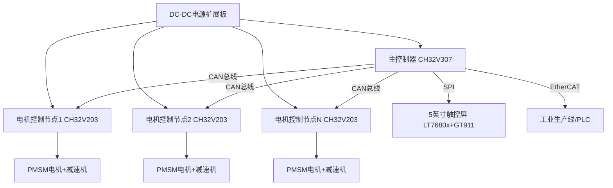

# 多功能可交互的PMSM无刷绕线机

📌 **项目作者**：星必尘Sguan | 📧**联系邮箱**：3464647102@qq.com

🔧 **技术栈**：CH32V系列MCU | SguanFOC算法 | FreeRTOS | CAN/EtherCAT

           


## 📖 项目简介

这是一款基于 全自研硬件 与 「SguanFOC」核心算法 打造的高性能PMSM无刷绕线机，主打「精准、高效、可交互、可扩展」四大核心优势。

🔄 系统架构：采用 CH32V307 主控 + 多块 CH32V203 电控板，构建分布式控制体系，通过 CAN 总线实现各电机节点精准协同；

📡 互联交互：支持 EtherCAT 工业以太网、UART 调试通信，搭配 5英寸 SPI 电容触控屏，操作直观、调试便捷；

🎯 控制精度：各电控板独立驱动 PMSM 电机，实现毫秒级位置/速度控制，搭配减速机进一步提升扭矩与绕线精度；

🎛️ 核心功能：融合多轴协同运动 + 实时张力控制，智能规划绕线轨迹、恒定张力输出，确保绕组一致性，为国产精密绕线装备的创新突破提供技术参考与实践助力。

---

## 🚀 核心特性 | Core Features

- 🎛️ **全自研硬件体系** | 定制3块专用PCB板（CH32V307主控板、CH32V203电机控制板、DC-DC电源扩展板），优化电气接口，适配工业场景长期稳定运行；

- 🔬 **专有SguanFOC算法** | 自研磁场定向控制算法，集成 Clarke/Park 变换、SVPWM 调制，搭配 SMO滑模观测器 + HFI高频注入，无编码器也能实现高精度控制；

- ⚙️ **分布式多轴控制** | 基于 FreeRTOS 实时操作系统，CAN总线实现多电机节点同步联动，支持多轴并行控制，可灵活扩展节点数量；

- 🌐 **工业级互联能力** | 支持 EtherCAT 工业以太网（亚毫秒级周期）、UART 调试，搭配 5英寸 SPI 电容触控屏（LT7680x+GT911），人机交互流畅；

- 🎯 **精密绕线表现** | 多轴协同运动 + 实时张力闭环控制，智能规划绕线轨迹，恒定张力输出，有效保障绕组一致性与产品合格率；

- 🔧 **开源可扩展** | 提供完整固件源代码、硬件设计文件（PCB/原理图）、Simulink仿真模型及详细技术文档，支持二次开发与定制适配。

---

## 🏗️ 系统架构 | System Architecture
采用 分层分布式控制架构，分离高级协调与底层电机控制，兼顾实时响应速度与系统可扩展性，示意图如下（可替换为实际架构图）：



### 核心模块详情

- 🖥️ 主控制器：CH32V307（144MHz RISC-V内核，256KB Flash + 64KB RAM），运行 FreeRTOS V202112.00，负责系统协调、轨迹规划、通信管理与HMI交互；

- 📟 电机控制节点：CH32V203 专用电机控制MCU，独立运行 SguanFOC 算法，实现 10-20kHz 高频电流控制、1-2kHz 速度控制；

- 🔋 电源系统：DC-DC 隔离稳压扩展板，具备输入保护、过流保护、电压监控功能，为全系统提供纯净稳定的供电。

---

## 📌 适用场景 | Application Scenarios

📦 该系统专为精密绕线应用设计，可广泛适配以下场景：

- 🔧 电机定子绕线：各类小型、中型电机定子线圈的自动化绕线作业；

- ⚡ 变压器线圈绕线：电力变压器、信号变压器的精密多层线圈绕线；

- 🔗 电感器制造：高频电感器、扼流圈的受控绕线，保障电感参数一致性；

- 📎 电子组件绕线：各类电子设备组件的电缆、线材有序绕线；

- 🏭 工业集成：通过 EtherCAT 接口，无缝集成到工业自动化生产线，实现无人化作业。

---

## 🛠️ 开发环境 | Development Environment

|🔧 工具/组件|📋 详情|
|---|---|
|开发IDE|MounRiver Studio（WCH官方IDE，含RISC-V GCC工具链）|
|主控芯片|CH32V307（主控制器）、CH32V203（电机控制节点）|
|操作系统|FreeRTOS V202112.00|
|仿真工具|MATLAB/Simulink（控制器参数设计、算法验证）|
|调试工具|WCH-Link（板载调试器）、串口调试助手|
---

## 📂 项目结构 | Project Structure

```plain text
PMSM_Winding_Machine/
├── 【PDF】项目工程参考/          # 📚 技术文档、数据手册、算法原理（SMO/HFI/PI调节）
├── 代码部分/                    # 💻 固件源代码
│   ├── QS_CH32V3/              # 🖥️ CH32V307主控制器固件（FreeRTOS任务、通信协调）
│   └── QS_CH32V2/              # 📟 CH32V203电机控制固件（SguanFOC算法、电机驱动）
├── 电控部分/                    # 🛠️ 硬件设计文件（PCB原理图、PCB版图）
│   ├── 主控板CH32V307/
│   ├── 电控板CH32V203/
│   └── 扩展板(DC-DC电源)/
├── 设计部分/                    # 📐 机械设计文件
├── README.md                    # 📖 项目说明（本文档）
└── LICENSE                      # 📜 许可信息
    
```

---

## 📖 快速开始 | Quick Start

1. 📥 克隆本仓库：`git clone 仓库地址`；

2. 🔧 安装 MounRiver Studio，导入 QS_CH32V3、QS_CH32V2 项目；

3. ⚙️ 配置项目参数（参考 FreeRTOSConfig.h、ch32v30x_conf.h 等配置文件）；

4. 🔥 编译固件，通过 WCH-Link 烧录到对应板卡；

5. 📡 连接硬件（CAN总线、电源、电机、触摸屏），通过串口/触摸屏验证系统运行。

---

## 📚 参考资料 | Reference

- CH32V307/CH32V203 芯片数据手册

- LT7680x 显示控制器、GT911 触摸控制器数据手册

- SMO滑模观测器、HFI高频注入算法原理文档

- MATLAB/Simulink 电流环/速度环 PI 参数设计模型

---

## ❗ 注意事项 | Notes

- ⚠️ 烧录固件前，请确认板卡供电电压稳定（参考硬件设计文档）；

- ⚠️ CAN总线接线需注意终端电阻匹配，避免通信异常；

- ⚠️ 电机参数需根据实际型号，在固件中调整 PI 控制器参数与算法参数；

- 💡 如需二次开发，建议先阅读 【PDF】项目工程参考/ 目录下的技术文档，了解系统架构与算法原理。

---

## ✨ 致谢 | Acknowledgments

感谢沁恒微电子（WCH）提供的 CH32V 系列MCU及技术支持，感谢所有开源社区的参考资料与灵感。

---

📅 项目更新日志 | Update Log

- 初始版本：完成核心硬件设计、SguanFOC算法开发与系统联调；

- 后续将持续优化算法精度、完善文档与二次开发教程。
